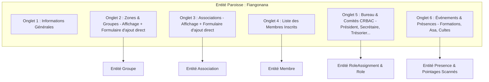

# Spécification Technique & Fonctionnelle de l'Administration Backoffice

Ce document décrit l'architecture, les fonctionnalités et la carte des routes du module d'administration backoffice de gestion paroissiale.

---

## 1. Vision & Objectifs

L'administration backoffice (`/admin`) offre un espace de gestion centralisé, moderne et sécurisé réservé aux dirigeants, secrétaires et responsables d'associations. Elle permet de :
* Suivre en temps réel les effectifs et indicateurs clés de la paroisse (`Fiangonana`), des zones géographiques (`Groupe`) et des associations.
* Gérer la paroisse (`Fiangonana`) et y rattacher / afficher directement ses **Zones & Groupes** et ses **Associations**.
* Gérer les fiches de membres, générer et imprimer leurs cartes d'identité officielles.
* Consulter les statistiques d'assiduité, les rapports d'activités et les taux de participation annuels.
* Gérer les mandats et droits d'accès via le modèle de sécurité contextuel (CRBAC).
* Administrer les structures (Paroisses, Zones, Associations) avec onglets dédiés pour :
  * **Informations Générales**.
  * **Zones & Groupes** (avec formulaire de création rapide direct).
  * **Associations Paroissiales** (avec formulaire de création rapide direct).
  * **Liste des membres rattachés**.
  * **Comités & Bureau (Président, Secrétaire, Trésorier)** via les attributions de rôles CRBAC.
  * **Gestion des événements (Formations, Asa, Cultes) & Présences associées**.

---

## 2. Diagramme de Concepteur & Architecture des Onglets (Mermaid)



---

## 3. Architecture Technique & Principes UI

* **Séparation MVC Strict** : Tout le rendu visuel est confiné dans le dossier `templates/admin/` sous forme de templates Twig responsives utilisant Tailwind CSS.
* **Architecture des Controllers** :
  * `AdminDashboardController` (`/admin/dashboard`) : Vue synthétique et tableaux de bord KPI.
  * `AdminFiangonanaController` (`/admin/fiangonana`, `/admin/fiangonana/nouveau`, `/admin/fiangonana/{id}/editer`, `/admin/fiangonana/{id}/nouveau-groupe`, `/admin/fiangonana/{id}/nouvelle-association`) : Gestion des paroisses avec leurs groupes, associations, membres, bureau et événements.
  * `AdminGroupeController` (`/admin/groupes`, `/admin/groupes/nouveau`, `/admin/groupes/{id}/editer`) : Gestion des zones géographiques avec membres, bureau et événements.
  * `AdminAssociationController` (`/admin/associations`, `/admin/associations/nouveau`, `/admin/associations/{id}/editer`) : Gestion des associations avec membres, comités et événements.
  * `AdminRoleController` (`/admin/roles`) : Gestion des rôles applicatifs et permissions.
  * `AdminMembreController` (`/admin/membres`, `/admin/membres/nouveau`, `/admin/membres/{id}/editer`) : Inscription, modification, carte membre, QR code et présences.
  * `AdminPresenceController` (`/admin/presences`) : Consolidation des événements, historique des scans et rapports de participation.

---

## 4. Cartographie des Routes Backoffice

```mermaid
graph TD
    Root[/admin] --> Dashboard[/admin/dashboard]
    Root --> Fiangonana[/admin/fiangonana]
    Root --> Groupes[/admin/groupes]
    Root --> Associations[/admin/associations]
    Root --> Roles[/admin/roles]
    Root --> Membres[/admin/membres]
    Root --> Presences[/admin/presences]

    Fiangonana --> FiangonanaEdit[/admin/fiangonana/{id}/editer - Tabs: Groupes, Associations, Membres, Bureau, Événements]
    FiangonanaEdit --> AddGroupe[/admin/fiangonana/{id}/nouveau-groupe]
    FiangonanaEdit --> AddAssociation[/admin/fiangonana/{id}/nouvelle-association]
    Groupes --> GroupeEdit[/admin/groupes/{id}/editer - Tabs: Membres, Bureau, Événements]
    Associations --> AssociationEdit[/admin/associations/{id}/editer - Tabs: Membres, Bureau, Événements]
    Membres --> MembreEdit[/admin/membres/{id}/editer - Tabs: Général, Roles CRBAC, Présences]
```
