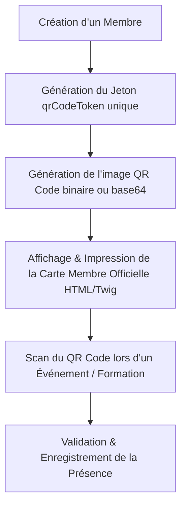

# Liste des Fonctionnalités Implémentées dans le Système Paroissial

Ce document recense de manière exhaustive toutes les fonctionnalités, API, entités et modules actuellement implémentés et fonctionnels dans l'application.

---

## 1. Modèle de Données & Entités Métier

Le système s'articule autour de 9 entités principales interconnectées :

1. **Fiangonana (Église / Paroisse)** : Entité paroissiale racine (`id`, `nom`, `code`).
2. **Membre (Membre Paroissial & Utilisateur)** : Personne physique inscrite (`id`, `nom`, `prenom`, `email`, `telephone`, `dateNaissance`, `qrCodeToken`, `fiangonana`, `zoneGeographique`, `associations`). Implémente également `UserInterface`.
3. **Groupe (Zone Géographique)** : Secteur ou zone résidentielle rattachée à une paroisse. Un membre appartient à 0 ou 1 zone.
4. **Association** : Structure interne (ex: Chorale, Section Jeunes, SAF/FJKM). Un membre peut adhérer à plusieurs associations.
5. **SousGroupe (Sous-groupe / Comité)** : Cellule de travail ou comité interne rattaché à une association parente.
6. **Feature (Fonctionnalité)** : Module applicatif cible de la sécurité (ex: `FINANCES`, `MEMBERSHIP`).
7. **Role (Rôle)** : Intitulé de fonction (ex: `PRESIDENT`, `TRESORIER`, `SECRETAIRE`, `CAISSIER`).
8. **Permission** : Matrice associant un Rôle, une Feature et une Action (`READ`, `WRITE`, `ADMIN`).
9. **RoleAssignment (Mandat & Attribution)** : Attribution d'un rôle à un membre dans un contexte spécifique (Église, Zone, Association, Sous-groupe) avec période de validité (`startDate`, `endDate`, `exerciceYear`, `isActive`).
10. **Presence (Présence & Participation)** : Enregistrement d'un pointage de présence d'un membre lors d'un événement ou d'une activité (`id`, `membre`, `activityName`, `scannedAt`, `scannedBy`).

---

## 2. Architecture de Sécurité & Contrôle d'Accès Contextuel (CRBAC)

* **Modèle CRBAC (Contextual Role-Based Access Control)** : Les habilitations ne sont pas statiques mais évaluées dynamiquement en fonction du contexte opérationnel (Paroisse, Zone, Association, Sous-Groupe) et du mandat actif du membre.
* **Voter de Sécurité Symfony** : `ContextualPermissionVoter` intercepte et valide l'accès selon les rôles attribués via `RoleAssignment` et la matrice `Permission`.

---

## 3. Cartes de Membre & Génération de Code QR



### Endpoints Implémentés :
* `GET /api/membres/{id}/carte` & `GET /api/membres/{id}/fiche` : Génère la fiche ou carte de membre officielle au format HTML responsive (utilisant Twig et Tailwind CSS) prête à l'impression, avec l'image du QR Code encodée en base64 inline.
* `GET /api/membres/{id}/qr-code` : Génère le flux binaire d'image PNG (300x300 px) du Code QR du membre. Supporte le paramètre `?raw=true` pour renvoyer le jeton alphanumérique brut.

---

## 4. Portail de Scan & Suivi des Présences

```mermaid
sequenceDiagram
    autonumber
    actor Responsable as Responsable / Scanneur
    participant Mobile as Terminal Mobile
    participant App as Application Symfony
    participant DB as Base de Données

    Responsable->>Mobile: Scanne le Code QR de la carte du membre
    Mobile->>App: GET /membres/scan/{token}
    App->>DB: Recherche du membre par qrCodeToken
    alt Membre trouvé
        App-->>Mobile: Formulaire HTML de validation (nom du membre & activité)
        Responsable->>Mobile: Sélectionne/Saisit l'activité et valide
        Mobile->>App: POST /membres/scan/{token} (activityName)
        App->>DB: Persiste l'entité Presence (scannedAt, scannedBy)
        App-->>Mobile: Écran de confirmation "Présence Validée !"
    else Membre non trouvé
        App-->>Mobile: Écran d'erreur "Code QR non reconnu"
    endif
```

### Endpoints Implémentés :
* `GET|POST /membres/scan/{token}` : Portal web interactif pour la prise de présence. Permet aux responsables d'enregistrer instantanément la présence d'un membre à un événement (ex: "Formation des Jeunes 2026", "Culte du Sabbat").
* `GET /api/presences` & `POST /api/presences` : Ressources REST API Platform pour la consultation et création de présences.

---

## 5. Statistiques & Taux de Participation Annuel

* **Endpoint `GET /api/membres/{id}/participation-stats`** :
  Calculateur du taux de participation d'un membre sur une année donnée (ex: `?year=2026`).
  * Compare le nombre d'activités distinctes auxquelles le membre a participé par rapport au nombre total d'activités organisées dans l'année.
  * Fournit le taux de participation (en %), la liste des activités assistées, ainsi que le journal d'historique détaillé des scans.
* **Endpoint `GET /api/membres/{id}/stats`** :
  Ressource globale retournant l'historique complet des présences d'un membre et la ventilation des participations par type d'activité.

---

## 6. APIs REST CRUD (API Platform 4.0)

Toutes les entités de l'application exposent des endpoints REST complets préfixés par `/api` (formats JSON, JSON-LD, Hydra) :

| Entité | Endpoints REST disponibles |
| :--- | :--- |
| **Fiangonana** | `GET`, `POST`, `GET /id`, `PATCH /id`, `DELETE /id` |
| **Membre** | `GET`, `POST`, `GET /id`, `PATCH /id`, `DELETE /id` |
| **Groupe** | `GET`, `POST`, `GET /id`, `PATCH /id`, `DELETE /id` |
| **Association** | `GET`, `POST`, `GET /id`, `PATCH /id`, `DELETE /id` |
| **SousGroupe** | `GET`, `POST`, `GET /id`, `PATCH /id`, `DELETE /id` |
| **Feature** | `GET`, `POST`, `GET /id`, `PATCH /id`, `DELETE /id` |
| **Role** | `GET`, `POST`, `GET /id`, `PATCH /id`, `DELETE /id` |
| **Permission** | `GET`, `POST`, `GET /id`, `PATCH /id`, `DELETE /id` |
| **RoleAssignment** | `GET`, `POST`, `GET /id`, `PATCH /id`, `DELETE /id` |
| **Presence** | `GET`, `POST`, `GET /id`, `PATCH /id`, `DELETE /id` |
