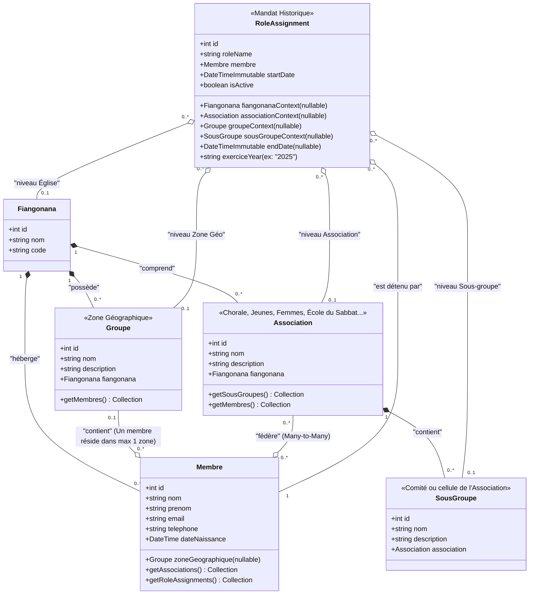
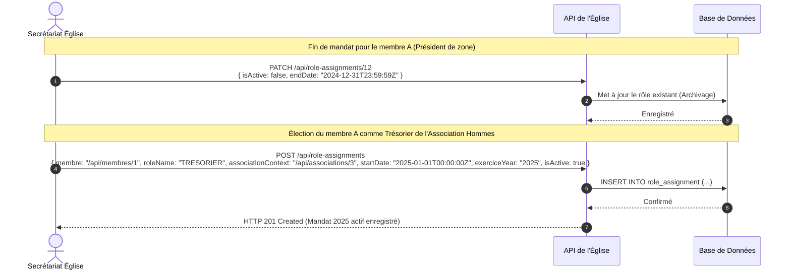

# Spécifications d'Organisation Paroissiale - Membres, Zones Géographiques, Associations & Mandats

Ce document détaille la conception technique et fonctionnelle permettant de modéliser la structure organisationnelle d'une paroisse, incluant la gestion des membres, des zones géographiques (appelées groupes), des associations (Chorales, École du Sabbat, etc.), des sous-groupes ainsi que le suivi historique des élections et mandats au fil des ans.

---

## 1. Description du Modèle & Contraintes Métier

L'église fonctionne comme une organisation multi-paliers avec les définitions et règles de gestion strictes suivantes :

### A. Les Structures Organisationnelles

1. **L'Église (Fiangonana)** : L'entité centrale globale qui chapeaute l'ensemble.
2. **Membres** : Les personnes physiques inscrites à l'église.
3. **Groupes (Zones Géographiques)** :
   * Les membres de l'église sont répartis dans des **zones géographiques** de résidence. Les membres résidant dans la même zone forment ce que l'on appelle un **Groupe** (ex: Groupe d'Andohanofotsy, Groupe de Behoririka Nord).
   * *Contrainte stricte* : **Un membre appartient à une unique zone géographique à la fois** (au plus un Groupe).
4. **Associations** :
   * Toutes les autres structures internes sont qualifiées d'**Associations** (ex: Association des Jeunes, Association des Hommes, Association des Femmes, la Chorale, l'Association de l'École du Sabbat, etc.).
   * *Règle de flexibilité* : **Un membre peut faire partie de plusieurs associations en même temps** (ou aucune). De nouvelles associations peuvent être créées librement sans altérer le code.
5. **Sous-groupes** :
   * Ce sont des cellules de travail, comités ou sous-divisions internes rattachés exclusivement à une association parente (ex: Comité des Jeunes Adultes de l'Association des Jeunes).

### B. Gestion des Mandats, Élections & Rôles Historiques

* **Périodes & Élections** : L'église procède régulièrement à des élections ou changements de rôles annuels.
* **Historisation des fonctions** : Un membre change fréquemment de responsabilités d'une année à l'autre. Par exemple :
  * *Année N-1* : Président du groupe/zone géographique "Andohanofotsy".
  * *Année N* : Élu président de la Chorale (Association).
  * *Année T* : Trésorier de l'Association des Hommes.
* **Modélisation temporelle** : Chaque attribution de rôle (`RoleAssignment`) doit être qualifiée par :
  * Une date de début (`startDate`) et une date de fin de mandat (`endDate`), ou une année d'exercice (ex: Mandat 2025).
  * Un état d'activité (`isActive` : vrai/faux).

---

## 2. Diagramme de Classes UML (Mermaid)

Le diagramme de classes ci-dessous intègre les zones géographiques (Groupes), les associations, ainsi que l'historisation des attributions de rôles pour chaque période d'activité.



---

## 3. Flux & Processus Clés (Mermaid)

### A. Flux de Passation lors d'une Nouvelle Élection

Ce flux de séquence décrit l'archivage d'un mandat expiré d'un membre et l'activation du nouveau rôle élu pour la nouvelle période de mandat.



---

## 4. Exemples de Payloads JSON pour l'API

### A. Création d'un Membre affecté à sa Zone Géographique (Groupe)

* **POST** `/api/membres`
* **Données** :

```json
{
  "nom": "Ratsimbazafy",
  "prenom": "Nirina",
  "email": "nirina@example.com",
  "telephone": "+261320000000",
  "dateNaissance": "1990-08-24T00:00:00Z",
  "groupe": "/api/groupes/2",
  "associations": [
    "/api/associations/1"
  ]
}
```

*(Ici, `/api/groupes/2` représente la zone résidentielle d'Andohanofotsy, l'unique groupe possible pour ce membre)*.

### B. Attribution d'un Rôle Élu pour un Mandat d'Exercice Spécifique

* **POST** `/api/role-assignments`
* **Données** :

```json
{
  "membre": "/api/membres/12",
  "role": "/api/roles/3",
  "associationContext": "/api/associations/1",
  "startDate": "2026-01-20T00:00:00Z",
  "endDate": "2026-12-12T23:59:59Z",
  "exerciceYear": "2026",
  "isActive": true
}
```

*(Le membre est enregistré avec un rôle contextuel attribué à une Association, une Zone Géographique ou une Paroisse, délimité dans le temps du 20/01/2026 au 12/12/2026)*.
