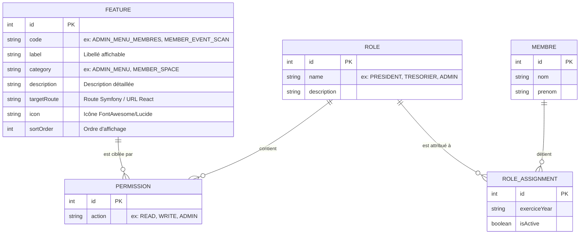
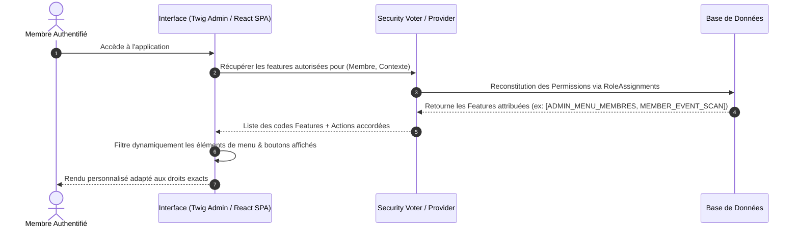

# Gestion des Droits et Habilitations Basée sur l'Entité `Feature`

Ce document présente l'architecture de la gestion dynamique des droits et habilitations au sein de la plateforme. Il s'appuie sur l'entité **`Feature`** (Fonctionnalité) pour recenser l'ensemble des fonctionnalités, menus backoffice admin et actions du portal Espace Membre afin de rendre dynamique l'affichage, les menus, ainsi que le contrôle d'accès.

---

## 1. Vision et Objectifs

Dans notre architecture **Contextual Role-Based Access Control (CRBAC)** :
- Un **Membre** détient un ou plusieurs **Rôles** au sein d'un **Contexte** (Paroisse / Fiangonana, Zone / Groupe, Association, Sous-groupe).
- Un **Rôle** regroupe un ensemble de **Permissions**.
- Une **Permission** associe un `Role` à une **`Feature`** pour une `Action` donnée (`READ`, `WRITE`, `ADMIN`, `EXECUTE`, etc.).
- L'entité **`Feature`** recense la totalité des points d'entrée fonctionnels (menus d'administration, onglets/actions de l'Espace Membre, opérations d'API).

Grâce à cette centralisation, nous pouvons :
1. **Piloter dynamiquement la navigation** : Générer automatiquement les menus de la sidebar d'administration et les onglets / modules de l'Espace Membre selon les habilitations du membre connecté.
2. **Gérer finement les droits par rôle** : Permettre à un administrateur d'attribuer ou restreindre dynamiquement l'accès à n'importe quel menu ou action sans modifier le code source.
3. **Harmoniser la sécurité API et UI** : Sécuriser simultanément les contrôleurs (Voter) et les interfaces utilisateur (Twig, React SPA).

---

## 2. Modèle de Données & Entité `Feature`

### 2.1 Schéma Relationnel



### 2.2 Propriétés de l'Entité `Feature`

| Champ | Type | Description | Exemple |
|---|---|---|---|
| `id` | `integer` | Identifiant unique généré. | `1` |
| `code` | `string(100)` | Code unique identifiant la fonctionnalité. | `ADMIN_MENU_MEMBRES` |
| `label` | `string(255)` | Nom lisible par l'utilisateur. | `Gestion des Membres` |
| `category` | `string(50)` | Catégorie/Zone (`ADMIN_MENU`, `MEMBER_SPACE`, `API_ACTION`). | `ADMIN_MENU` |
| `description` | `text` | Explication fonctionnelle. | `Permet d'accéder au CRUD des membres.` |
| `targetRoute` | `string(255)` | Route Symfony ou path SPA React associées. | `app_admin_membre_index` |
| `icon` | `string(100)` | Classe d'icône d'interface. | `fas fa-users` |
| `sortOrder` | `integer` | Ordre pour le rendu dynamique du menu. | `10` |

---

## 3. Cartographie Complète des `Features`

L'ensemble des menus Backoffice Admin et des actions Espace Membre sont répertoriés ci-dessous.

### 3.1 Menus du Backoffice Administration (`category: ADMIN_MENU`)

| Code Feature | Libellé | Route / URL | Description |
|---|---|---|---|
| `ADMIN_MENU_DASHBOARD` | Tableau de bord | `app_admin_dashboard` | Vue globale de l'administration et statistiques. |
| `ADMIN_MENU_FIANGONANA` | Paroisses / Fiangonana | `app_admin_fiangonana_index` | Gestion de l'entité paroissiale racine. |
| `ADMIN_MENU_GROUPES` | Zones / Groupes | `app_admin_groupe_index` | Gestion des zones géographiques et groupes. |
| `ADMIN_MENU_ASSOCIATIONS` | Associations | `app_admin_association_index` | Managing church associations (Femmes, Hommes, Jeunesse...). |
| `ADMIN_MENU_MEMBRES` | Membres | `app_admin_membre_index` | Gestion globale de l'annuaire des membres. |
| `ADMIN_MENU_ROLES` | Rôles & Habilitations | `app_admin_role_index` | Gestion des rôles, attributions et permissions CRBAC. |
| `ADMIN_MENU_EVENEMENTS` | Événements | `app_admin_evenement_index` | Création et suivi des événements paroissiaux. |
| `ADMIN_MENU_TYPES_EVENEMENT` | Types d'Événements | `app_admin_type_evenement_index` | Catégorisation des événements (Culte, Réunion, Fête...). |
| `ADMIN_MENU_PRESENCES` | Suivi des Présences | `app_admin_presence_index` | Visualisation et gestion du pointage des présences. |

### 3.2 Actions & Vue de l'Espace Membre (`category: MEMBER_SPACE`)

| Code Feature | Libellé | Target Route / Path | Description |
|---|---|---|---|
| `MEMBER_PROFILE_VIEW` | Profil Membre | `/espace-membre/profile` | Consultation des informations personnelles et carte de membre. |
| `MEMBER_PROFILE_UPDATE` | Mise à jour Profil | `/api/membres/{id}/update-profile` | Modification du nom, prénom, email, téléphone et photo avatar. |
| `MEMBER_PASSWORD_CHANGE` | Changement Mot de passe | `/api/me/change-password` | Modification sécurisée de son propre mot de passe. |
| `MEMBER_CARTE_GENERATE` | Carte de Membre & QR Code | `/api/membres/{id}/carte` | Génération de la carte officielle avec QR code unique. |
| `MEMBER_EVENTS_VIEW` | Liste des Événements | `/espace-membre/events` | Consultation des événements à venir et passés. |
| `MEMBER_EVENT_CREATE` | Création d'Événement | `/api/member-events/create` | Saisie d'un nouvel événement par un membre responsable. |
| `MEMBER_EVENT_SCAN` | Scanner QR Code Présence | `/api/member-events/{id}/scan` | Scan caméra direct pour marquer la présence d'un membre. |
| `MEMBER_EVENT_ATTENDEES` | Liste des Présents | `/api/member-events/{id}/attendees` | Consultation en temps réel des membres présents à un événement. |
| `MEMBER_EVENT_NOTE_ADD` | Ajouter une Note/Évaluation | `/api/member-events/{id}/add-note` | Ajout de remarques ou évaluations sur un événement. |
| `MEMBER_EVENT_COMPTE_RENDU` | Compte Rendu | `/api/member-events/{id}/compte-rendu` | Rédaction / mise à jour du procès-verbal ou résumé d'événement. |
| `MEMBER_EVENT_MEDIA_UPLOAD` | Envoi Photos & Vidéos | `/api/member-events/{id}/upload-media` | Téléversement de photos/vidéos associées à un événement. |
| `MEMBER_AFFILIATIONS_VIEW` | Mes Affiliations & Groupes | `/espace-membre/affiliations` | Consultation des associations et zones du membre. |
| `MEMBER_AFFILIATION_MANAGE` | Gestion des Membres d'Association | `/api/association-membres/save` | Ajout / modification des membres au sein de son association. |
| `MEMBER_STATS_VIEW` | Taux de Participation | `/api/membres/{id}/participation-stats` | Suivi annuel des statistiques d'assiduité et présences. |

---

## 4. Flux Dynamique de Rendu des Menus et Contrôle d'Accès



---

## 5. Exemple de Structure JSON API (`/api/features`)

L'API REST expose les entités `Feature` pour alimenter le front-end React ou les composants Twig :

```json
[
  {
    "id": 1,
    "code": "ADMIN_MENU_MEMBRES",
    "label": "Gestion des Membres",
    "category": "ADMIN_MENU",
    "description": "Permet d'accéder à la liste et aux fiches des membres dans l'administration.",
    "targetRoute": "app_admin_membre_index",
    "icon": "fas fa-users",
    "sortOrder": 10
  },
  {
    "id": 2,
    "code": "MEMBER_EVENT_SCAN",
    "label": "Scan QR Code Présence",
    "category": "MEMBER_SPACE",
    "description": "Scanneur QR Code caméra pour valider la présence lors d'un événement.",
    "targetRoute": "/espace-membre/events",
    "icon": "fas fa-qrcode",
    "sortOrder": 20
  }
]
```

---

## 6. Prochaines Étapes de Déploiement

1. Mettre à jour l'entité PHP `Feature` dans `src/Entity/Feature.php`.
2. Ajouter les tests unitaires / d'intégration correspondants dans `tests/Entity/FeatureTest.php`.
3. Valider l'exécution des tests PHPUnit et des exigences de qualité.
