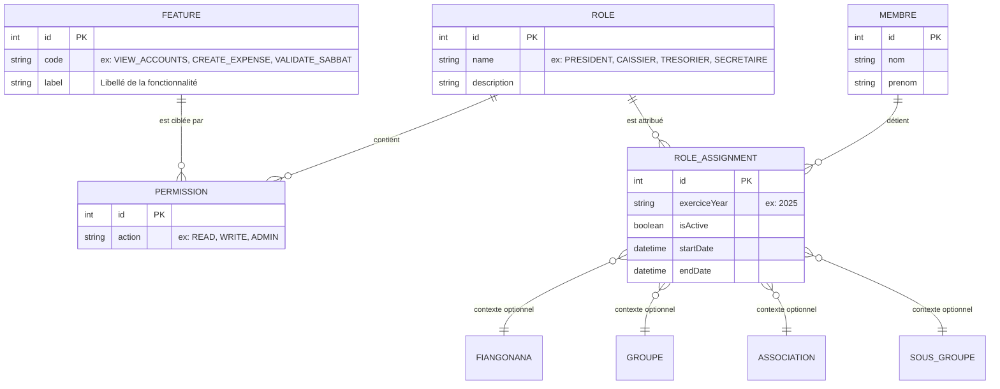
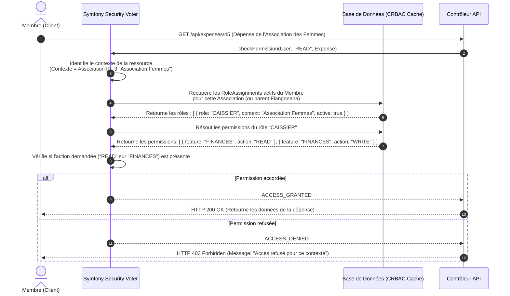

# Conception d'Habilitation Contextuelle - Sécurité & Contrôle d'Accès Dynamique (CRBAC)

Ce document décrit l'architecture de sécurité, de gestion des rôles, de contrôle d'accès et d'attribution de permissions contextuelles (CRBAC - *Contextual Role-Based Access Control*) au sein du système.

L'objectif principal est de fournir un système **flexible**, **évolutif** et **totalement piloté par la base de données** (Database-driven), évitant tout code durci (*hardcoded*) lors de l'ajout de nouvelles associations, zones géographiques, rôles ou règles de sécurité.

---

## 1. Pourquoi le RBAC classique ne convient pas ?

Dans un système classique de contrôle d'accès basé sur les rôles (RBAC), un utilisateur possède un rôle global (ex: `ROLE_USER`, `ROLE_ADMIN`).

Dans notre contexte paroissial, un membre n'est pas simplement "Trésorier" ou "Président" de manière absolue. Il l'est **toujours par rapport à un périmètre précis** :

* Le membre **A** est caissier de l'**Association des Femmes**. Il doit pouvoir lire et écrire les comptes de l'Association des Femmes.
* Le membre **A** ne doit **en aucun cas** pouvoir voir ou modifier les comptes de l'**Association des Hommes**.
* Le président de la paroisse (**Fiangonana**) doit pouvoir superviser l'ensemble des comptes de sa paroisse (administration générale).
* Les habilitations changent dynamiquement chaque année lors des nouvelles élections (notion de mandat).

Nous implémentons donc un **Contrôle d'Accès Basé sur les Rôles Contextuels (CRBAC)**. L'accès à une ressource dépend d'un triplet :

$$\text{Décision d'accès} = f(\text{Membre}, \text{Contexte de la ressource}, \text{Action demandée})$$

---

## 2. Le Modèle de Données de Sécurité & Permissions

Pour assurer une flexibilité absolue, nous concevons les entités de sécurité suivantes :

### Description des tables de sécurité :

1. **FEATURE (Fonctionnalité)** : Représente une zone fonctionnelle de l'application (ex: `FINANCES`, `MEMBERSHIP`, `SABBAT_REPORT`).
2. **PERMISSION** : Associe un `ROLE` à une `FEATURE` pour une action précise (`READ`, `WRITE`, `ADMIN`).
   * *Exemple* : Le rôle `CAISSIER` possède la permission `WRITE` sur la fonctionnalité `FINANCES`.
3. **ROLE_ASSIGNMENT (Attribution de Rôle)** : Lie un membre à un rôle au sein d'un contexte spécifique (Église, Zone/Groupe, Association ou Sous-groupe), limité par une période (mandat actif).

---

## 3. Algorithme de Décision d'Accès (Security Voter Flow)

Lorsqu'un utilisateur authentifié demande à effectuer une action (ex: lire un compte de dépenses) sur une ressource ciblée, l'application exécute le flux d'autorisation suivant :

---

## 4. Scénarios Concrets de Sécurité

### Cas A : Le Caissier de l'Association des Femmes

* **Membre** : "Rasoa"
* **Mandat** : Exercice 2025 (`isActive: true`)
* **Rôle attribué** : `CAISSIER`
* **Contexte** : `Association : Association des Femmes`
* **Permissions effectives** : `READ` et `WRITE` sur la fonctionnalité `FINANCES` uniquement au sein de ce contexte d'association.
* **Résultat d'accès** :
  * Rasoa accède au compte et saisit des dépenses pour l'Association des Femmes : **AUTORISÉ** ✅
  * Rasoa tente d'accéder au compte de l'Association des Hommes : **REFUSÉ** ❌ (Aucun mandat actif n'associe Rasoa à l'Association des Hommes).

### Cas B : Le Président de l'Église (Fiangonana)

* **Membre** : "Pasteur Naivo"
* **Rôle attribué** : `PRESIDENT`
* **Contexte** : `Fiangonana : Paroisse de Behoririka` (Contexte Racine/Global)
* **Héritage des droits** : La hiérarchie des contextes permet au contexte parent global (`Fiangonana`) d'hériter en cascade d'un droit de regard/lecture sur tous ses sous-contextes (Associations, Zones géographiques, Sous-groupes).
* **Résultat d'accès** :
  * Pasteur Naivo consulte les comptes de la paroisse : **AUTORISÉ** ✅
  * Pasteur Naivo consulte les comptes de l'Association des Femmes : **AUTORISÉ** ✅ (par héritage hiérarchique).

### Cas C : Le Président de l'Association des Hommes

* **Membre** : "Rakoto"
* **Rôle attribué** : `PRESIDENT`
* **Contexte** : `Association : Association des Hommes`
* **Résultat d'accès** :
  * Rakoto consulte et gère l'Association des Hommes : **AUTORISÉ** ✅
  * Rakoto tente d'accéder aux comptes de l'Association des Femmes : **REFUSÉ** ❌ (Pas d'habilitation sur ce contexte).

---

## 5. Flexibilité & Évolutivité Totale

Ce modèle élimine toute rigidité technique :

1. **Ajout d'une nouvelle association** (ex: *Association des Écoles du Sabbat*) :
   * Il suffit de l'insérer dans la table `association`.
   * Aucune ligne de code PHP n'a besoin d'être réécrite. Le système de sécurité reconnaîtra immédiatement les requêtes et les attributions de rôles pour cette nouvelle association.
2. **Création d'un nouveau rôle** (ex: *Conseiller Spirituel*) :
   * Ajoutez une ligne dans la table `role`.
   * Associez les permissions souhaitées dans la table `permission`.
   * Le rôle est immédiatement disponible pour être attribué à un membre dans n'importe quel contexte pour le mandat en cours.
3. **Délégation temporaire** :
   * Si le caissier de l'Association des Hommes part en voyage, un administrateur peut créer un `RoleAssignment` temporaire de type `CAISSIER` pour le membre remplaçant avec des dates précises (`startDate` et `endDate`). Le remplaçant aura accès automatiquement durant la période, et perdra l'accès dès la date passée, assurant une conformité de sécurité optimale.
