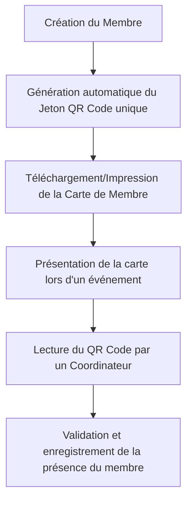
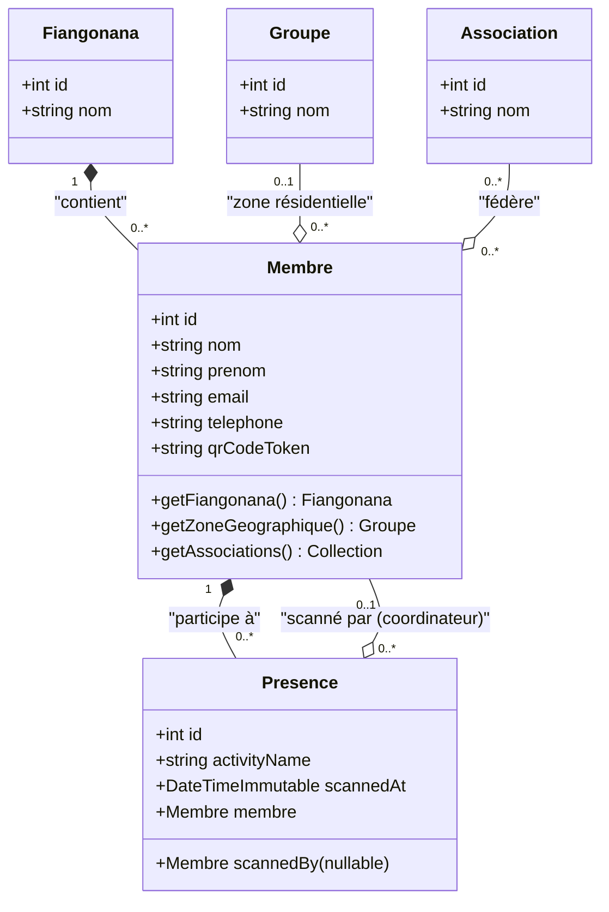
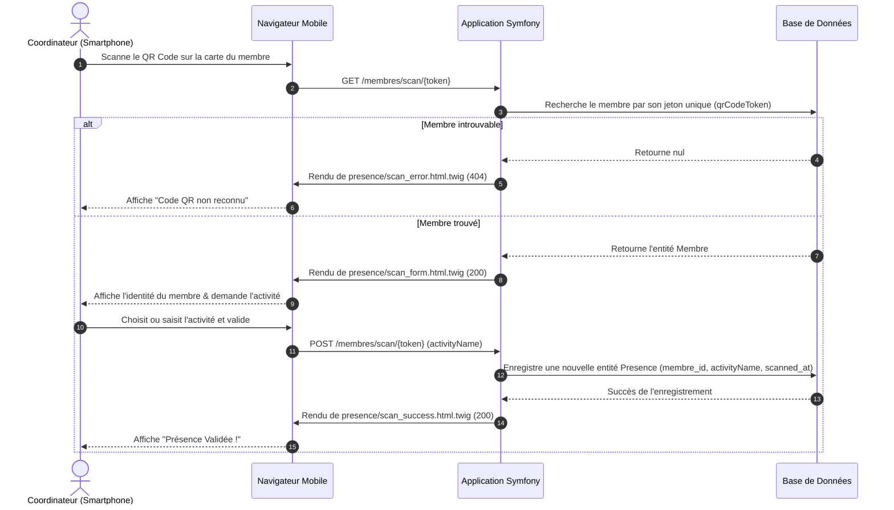

# Gestion de Carte Membre & Code QR : Spécifications Fonctionnelles et Techniques

Ce document décrit la conception technique et fonctionnelle du système de génération de cartes de membre officielles et du suivi des présences via la technologie Code QR.

---

## 1. Description Fonctionnelle & Cas d'Utilisation

L'objectif principal de ce module est de simplifier l'identification des membres de la paroisse et d'automatiser le suivi de leur participation aux différents cultes, séances de formation et réunions d'association.

### A. Les Acteurs Clés

1. **Le Membre** : Possède une carte d'identité physique ou numérique imprimable qui comporte ses informations de contact, ses groupes (zone) ou associations, et un Code QR unique et sécurisé.
2. **Le Coordinateur / Secrétaire** : Scanne la carte du membre à l'aide d'un terminal mobile (smartphone, tablette ou lecteur optique) lors des événements pour valider leur présence.

### B. Le Cycle d'Utilisation de l'Identité Membre

---

## 2. Diagramme de Classes & Modèle de Données (Mermaid)

Le diagramme de classes suivant montre comment la gestion des présences et de l'identité s'articule autour de l'entité centrale `Membre` :

---

## 3. Architecture Technique

### A. Jeton Unique Sécurisé (QR Code Token)

Chaque membre se voit attribuer un jeton aléatoire unique (`qrCodeToken`) généré de manière sécurisée lors de sa création. Ce jeton sert d'identifiant opaque codé dans l'URL du QR Code, garantissant ainsi l'anonymat et la sécurité des données des membres en dehors du système de l'église.

### B. Génération des QR Codes (`endroid/qr-code`)

Le système s'appuie sur la bibliothèque PHP `endroid/qr-code` pour générer dynamiquement des codes QR sous forme de flux binaires d'image (PNG) ou de code base64 intégrable.

* **Format par défaut du QR code** : L'URL encodée pointe vers le endpoint de scan de présence de l'application : `https://{host}/membres/scan/{token}`.
* **Option de jeton brut (Raw)** : En ajoutant le paramètre optionnel `?raw=true`, l'image retournée contient uniquement le jeton alphanumérique brut.

### C. Séparation MVC avec Modèles Twig

Conformément aux meilleures pratiques d'ingénierie logicielle et aux exigences d'architecture Symfony, **tout le code HTML est strictement confiné dans des templates Twig** situés dans le répertoire `templates/`. Les contrôleurs se contentent de structurer les données et de déléguer le rendu HTML à Twig.

| Contrôleur | Template Twig associé | Rôle |
| :--- | :--- | :--- |
| `MembreCarteController` | `templates/membre/carte.html.twig` | Génération de la carte de membre officielle, prête pour l'impression (mise en page moderne responsive avec Tailwind CSS). |
| `PresenceScanController` | `templates/presence/scan_form.html.twig` | Formulaire interactif de validation de présence (sélection d'activité / saisie libre). |
| `PresenceScanController` | `templates/presence/scan_success.html.twig` | Écran de confirmation de présence enregistrée avec succès. |
| `PresenceScanController` | `templates/presence/scan_error.html.twig` | Écran d'erreur en cas de code QR invalide ou non reconnu. |

---

## 4. Cinématique de Validation de Présence

Le diagramme de séquence ci-dessous détaille les échanges réseau et l'interaction utilisateur lors du scan d'un QR code de membre.

---

## 5. Endpoints de l'API

### 1. Génération de Carte d'Identité Membre
* **URL** : `GET /api/membres/{id}/carte`
* **Type de retour** : `text/html; charset=utf-8`
* **Description** : Retourne une carte d'identité visuellement soignée, prête à être imprimée ou sauvegardée en PDF. Elle intègre les informations du membre, de sa paroisse, de sa zone géographique, de ses associations et son QR Code sous forme de base64 en ligne.

### 2. Flux Image du Code QR
* **URL** : `GET /api/membres/{id}/qr-code`
* **Paramètres Query** : `raw` (booléen optionnel, ex: `?raw=true`)
* **Type de retour** : `image/png`
* **Description** : Renvoie le code QR généré pour le membre. S'il n'est pas en mode brut (`raw`), le QR Code contient une URL absolue vers le scanneur de présences.

### 3. Portail de Scan et Validation
* **URL** : `GET|POST /membres/scan/{token}`
* **Type de retour** : `text/html; charset=utf-8`
* **Description** : Point d'accès universel accessible par appareil photo de smartphone. Permet de choisir l'activité courante et de confirmer instantanément la présence du membre en base de données.
